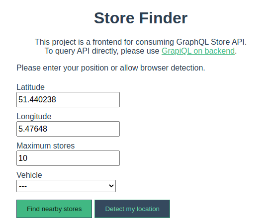

# Store Finder

> Easily find the nearest stores and critical information need to plan your next grocery shopping trip!

## Table of contents

- [General info](#general-info)
- [Screenshot](#screenshot)
- [Technologies](#technologies)
- [Setup](#setup)
  - [Backend Setup](#backend-setup)
  - [Frontend Setup](#frontend-setup)

## General info

This project is a demonstration of NodeJS/Express/GraphQL powered backend that feeds information to VueJS application.  
While normally application like this would use Mongo as well, I decided to keep it simple and store data in the JSON file.  
The data retrival layer on the backend is abstracted via repository so switching to Mongo should be easy.

I've initially considered using full framework (eg. [NestJS](https://nestjs.com/)) for backend, but decided against it.  
While excellent for production applications, it introduces a lot of magic when dealing with GraphQL - I wanted to tackle that challenge myself.  
Frontend and backend are separate applications because frontend can be served serverlessly.

## Screenshot

## Technologies

- [NodeJS](http://nodejs.org/)
- [Express](https://expressjs.com/)
- [GraphQL](https://www.gatsbyjs.org/)
- [VueJS](https://vuejs.org/)

## Setup

### Requirements

- Linux or macOS are recommended.
- NodeJS 14 (exact version specified in `.nvmrc`)
- Yarn is recommended.

### Backend Setup

- `cd backend/`
- `yarn install`
- `yarn start`
- Visit http://localhost:5000/graphql

### Frontend Setup

- `cd frontend`
- `yarn install`
- `yarn serve`
- Visit http://localhost:8080/
