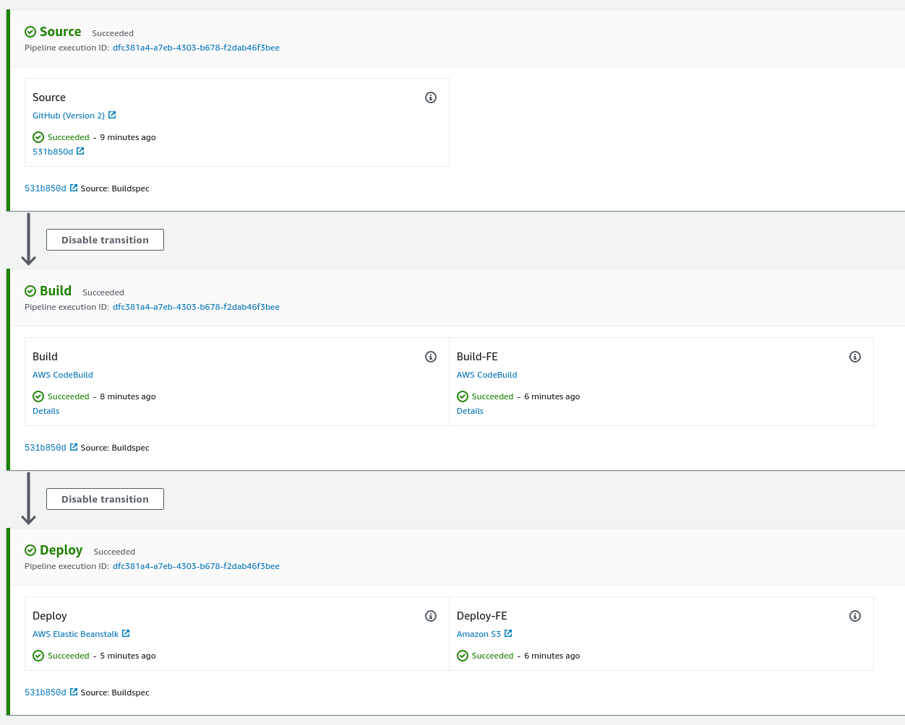
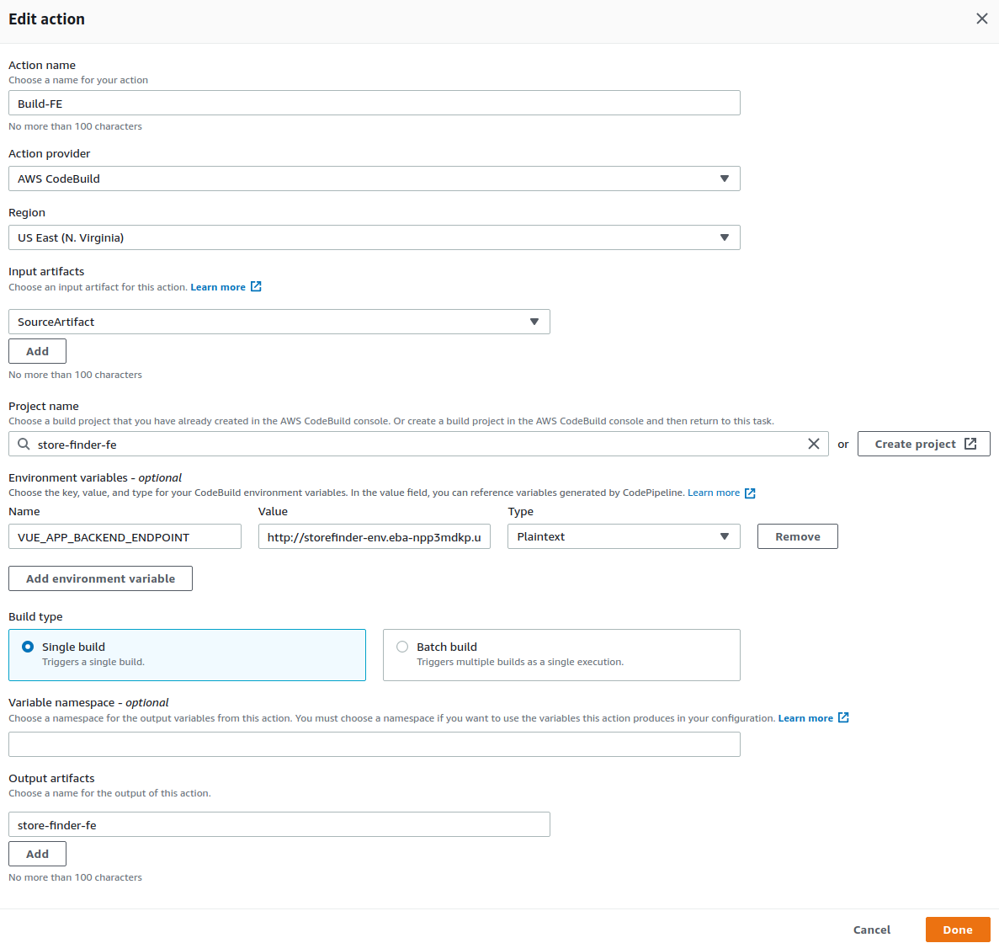
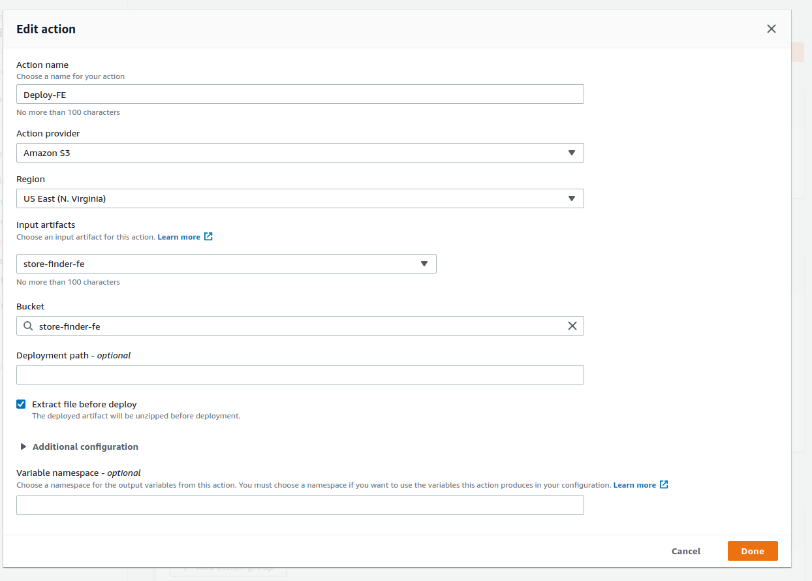

# Pipeline

CI/CD is implemented using AWS CodePipeline.

When code is pushed to Github's master branch, webhook triggers AWS CodeStar, starting pipeline.  
Code is then cloned and zipped, then passed on to Build step.

In Build step, Node environment is setup for both projects.  
Configuration is manged in two places.  
Action provider is set to AWS CodeBuild where build is setup.  
Build system image is defined there, as well as configuration for Artifact output (zipping and placing in s3 bucket).  
buildspec.yml handles build implementation.

Finally, code is deployed to either AWS Elastic Beanstalk (backend) or to S3 in case of frontend.

